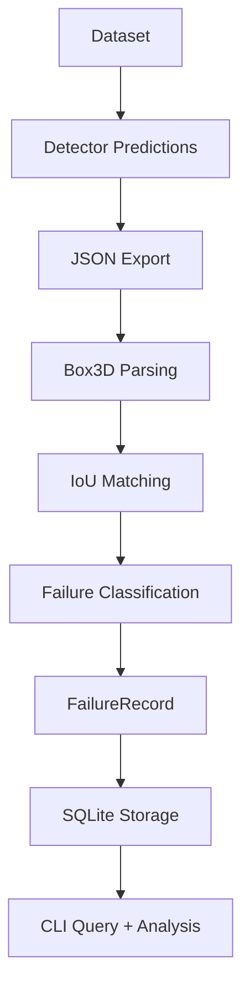

# Perception Error Triage Engine (MVP)

**A lightweight evaluation pipeline for turning 3D detector outputs into structured, queryable failure records.**

Dataset -> Detector Predictions -> Match Against Ground Truth -> Store Failures -> Query + Analyze

This project does **not** train a model. It focuses on evaluation infrastructure: taking predictions and labels, classifying failure modes, storing them, and making them easy to inspect.

## Problem

Modern perception systems produce large volumes of predictions, but diagnosing model failures remains slow and manual. This project implements a lightweight **perception error triage engine** that:

1. Compares detector outputs with ground truth
2. Classifies detection failures
3. Stores them in a queryable database
4. Generates a Confusion Matrix for rapid analysis of class-level error patterns

The goal is to accelerate iteration on perception models by making errors **structured, searchable, and analyzable**.

## Example observations: 

- "False negatives increase significantly beyond 40m."
- "Pedestrian and Cyclist class confusion only occurs in low-point-density regions."
- "Localization errors increase sharply for half-occluded vehicles!"

## Pipeline Overview



## Project Structure

```text
perception-triage/
  README.md
  LICENSE
  pyproject.toml
  requirements.txt
  scripts/
    build_failures.py
    make_synth.py
  src/
    triage/
      __init__.py
      schema.py
      matching.py
      failures.py
      db.py
      cli.py
      confusion.py
  tests/
```

## Quick Start

1. Create a virtual environment.
2. Install the package.
3. Build a failure database from prediction and ground-truth JSON.
4. Query failures or generate a confusion matrix.

## Installation

Recommended:

```bash
pip install -e .
```

Alternative:

```bash
pip install -r requirements.txt
export PYTHONPATH=src
```

## Example JSON Format

Predictions:

```json
[
  {
    "frame_id": "000042",
    "image_path": "path/to/000042.png",
    "predictions": [
      {
        "x": 1.2,
        "y": 5.1,
        "z": 0.0,
        "dx": 1.6,
        "dy": 3.9,
        "dz": 1.5,
        "yaw": 0.1,
        "class": "Car",
        "score": 0.92
      }
    ]
  }
]
```

Ground truth:

```json
[
  {
    "frame_id": "000042",
    "image_path": "path/to/000042.png",
    "ground_truth": [
      {
        "x": 1.0,
        "y": 5.0,
        "z": 0.0,
        "dx": 1.6,
        "dy": 3.9,
        "dz": 1.5,
        "yaw": 0.1,
        "class": "Car",
        "occlusion": 1,
        "truncation": 0.0,
        "num_points": 12,
        "box_height_px": 18
      }
    ]
  }
]
```

## Commands

Build the failure database:

```bash
python -m triage.cli build \
  --predictions data/preds.json \
  --ground-truth data/gt.json \
  --db failures.db \
  --iou-threshold 0.5 \
  --loc-threshold 0.1
```

Query failure cases:

```bash
python -m triage.cli query \
  --db failures.db \
  --type FN \
  --class Car \
  --min-distance 30 \
  --max-points 10
```

Generate a confusion matrix:

```bash
python -m triage.cli confusion \
  --predictions preds.json \
  --ground-truth gt.json
```

By default, the confusion command uses `class_aware=False` so near-miss class confusions appear as off-diagonal counts. Use `--class-aware` for same-class-only matching, or `--json` for machine-readable output.

Generate synthetic demo data:

```bash
python scripts/make_synth.py
python -m triage.cli build --predictions preds.json --ground-truth gt.json --db failures.db
python -m triage.cli query --db failures.db --type FN
python -m triage.cli confusion --predictions preds.json --ground-truth gt.json
```

## Example Output

```text
  frame_id  type    class         distance_m  box_height_px    num_points      confidence  iou    image_path
----------  ------  ----------  ------------  ---------------  ------------  ------------  -----  ----------------
    000000  FP      Car             11.6708                                      0.902358         frame_000000.png
    000000  FP      Car             10.1807                                      0.6              frame_000000.png
    000001  FP      Car             18.8014                                      0.6              frame_000001.png
    000002  FP      Pedestrian      21.9362                                      0.6              frame_000002.png
    000003  FP      Car              4.96158                                     0.827382         frame_000003.png
    000003  FP      Car             20.0365                                      0.6              frame_000003.png
    000004  FP      Cyclist         21.589                                       0.6              frame_000004.png
```

Example confusion matrix:

```text
gt\pred       Car    Cyclist    Pedestrian
----------  -----  ---------  ------------
Car             3          0             0
Cyclist         0          5             0
Pedestrian      2          0             5
```

## Failure Types

| Type | Description |
|------|-------------|
| TP | Prediction correctly matches a ground-truth box |
| FP | Prediction does not correspond to any ground-truth box |
| FN | Ground-truth object was missed by the detector |
| LOC | Prediction overlaps a ground-truth box but fails the main IoU threshold |

## Design Choices

### Axis-aligned IoU

The default matcher uses axis-aligned 3D IoU and ignores yaw.

Pros:

- Simple to implement
- Fast to compute
- Good enough for MVP pipeline validation

Tradeoffs:

- Overlap is inaccurate for rotated boxes
- Some localization errors will be misclassified

### SQLite Storage

SQLite is used for the MVP because it is easy to distribute and requires no service setup.

Pros:

- Single-file database
- Indexed queries
- Good local developer experience

Tradeoffs:

- Not ideal for large, multi-user workloads
- No run management or deduplication yet

## Limitations

- Matching is greedy and does not enforce one-to-one assignment.
- The default IoU implementation is axis-aligned.
- The confusion matrix currently counts matched pairs only.
- The database schema is intentionally minimal and optimized for local analysis.

## Waymo / OpenPCDet (Planned Demo)

This repo is designed to support a workflow like:

1. Prepare Waymo Open Dataset data.
2. Run OpenPCDet CenterPoint inference.
3. Export predictions and ground truth to the JSON schema above.
4. Build the failure database and analyze it locally.

This integration is **planned but not yet implemented end to end in this repo**. The current  path is the synthetic data workflow plus the failure database and confusion-matrix tooling due to limitations on MPS.

## Roadmap

- Add an exporter for OpenPCDet CenterPoint outputs
- Add oriented 3D IoU
- Add richer failure attributes such as weather and time of day
- Add failure visualizations for quick frame inspection
